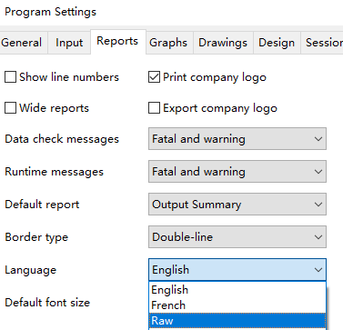

# HTRI 报告中文化工具

将 HTRI 导出的 xls 报告（report）文档翻译为中文。

## 系统要求
* Windows
* Excel
* Python 3.6+

## 准备工作
1. 将 Languages 下的 Raw 文件夹整体拷入 HTRI 的 Languages 目录（Program Files (x86)/HTRI/Xchanger Suite../Languages/）。
2. 在 HTRI 中，将语言调整为 Raw（Program Settings -> Reports -> Language）。


3. 安装依赖
```commandline
pip -r requirements.txt
```

## 使用
```python
from translate import process

# single file / 单文件模式
process('./sample/Xist_TEMA.xls', out='./sample/Xist_TEMA_chs.xls', lang='chs')
# folder / 文件夹模式
process('sample', out='./sample/chs', lang='chs')
```
